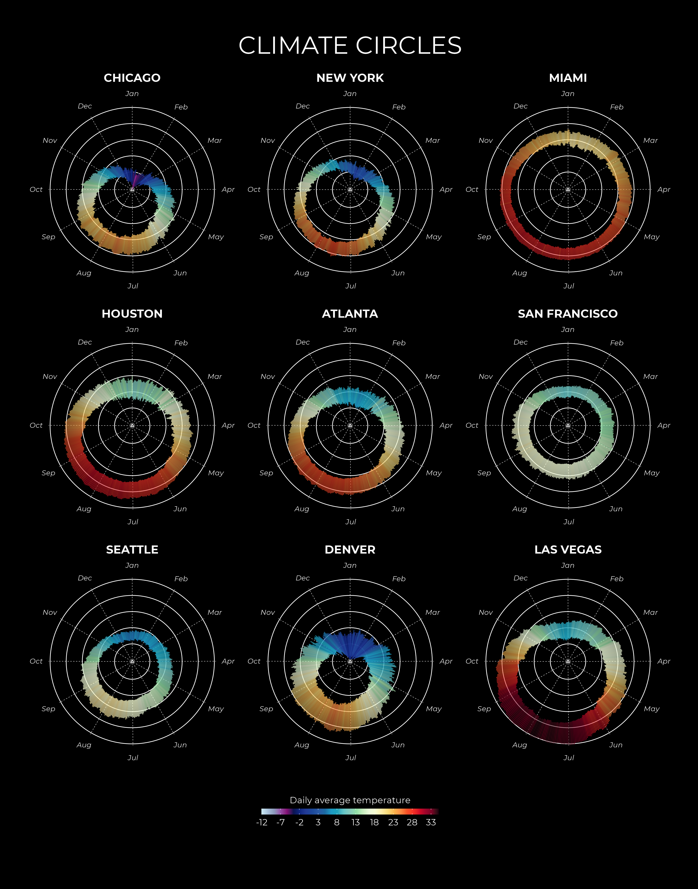
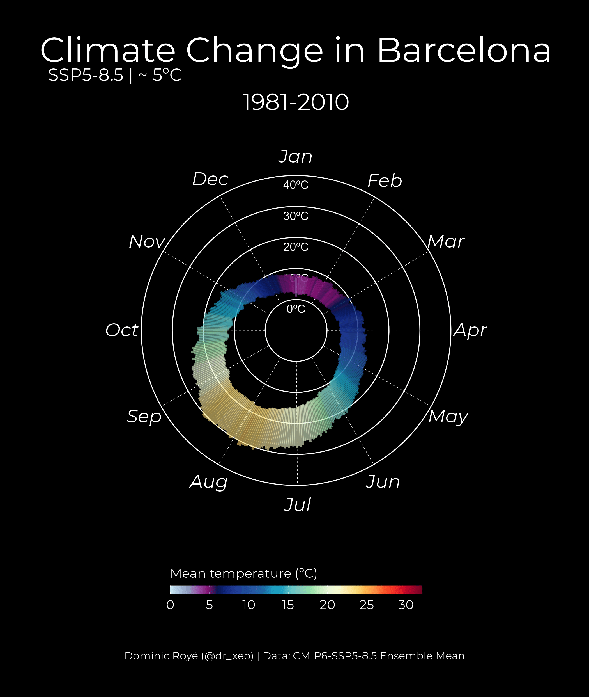
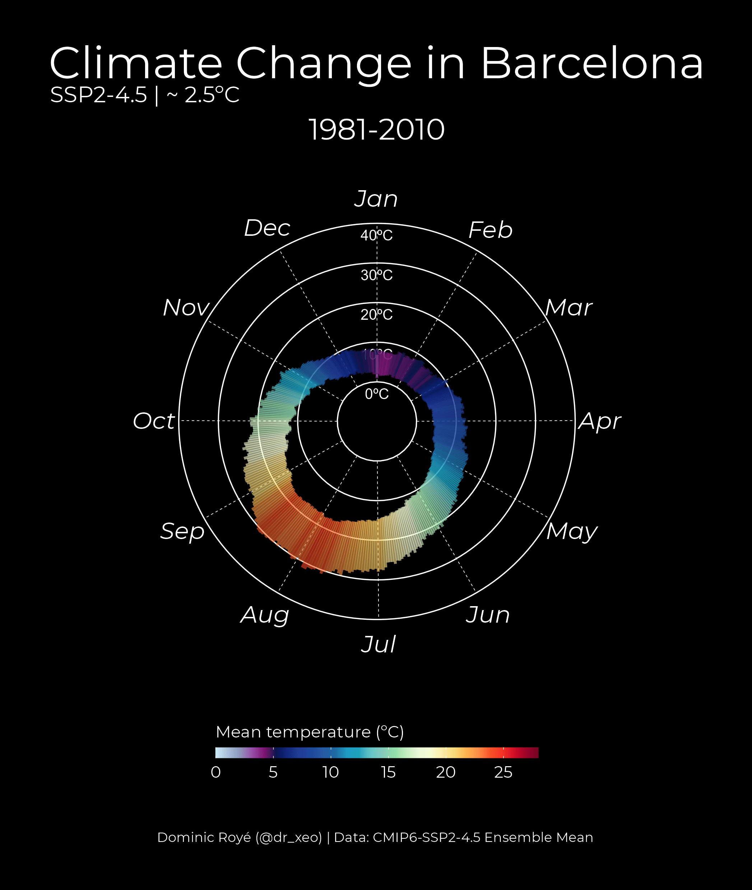

# Climate Circles Projections

The climate of a place is usually presented through climographs that combine monthly precipitation and temperature in a single chart. However, it is also interesting to visualize the climate on a daily scale showing the thermal amplitude and the daily average temperature. To do this, the averages for each day of the year of daily minimums, maximums and means are calculated.

The annual climate cycle presents a good opportunity to use a radial or polar chart which allows us to clearly visualize seasonal patterns. 

This is why I made this chart recently for some cities, see more in my blog post [https://dominicroye.github.io/en/2021/climate-circles/]https://dominicroye.github.io/en/2021/climate-circles/).

In this new repository I made animation with climate change projections based on CMIP6 for selected cities using the SSP2-4.5 (~ 2.5ºC) and SSP5-5.8 (~ 5ºC) pathways. 

## Spain

